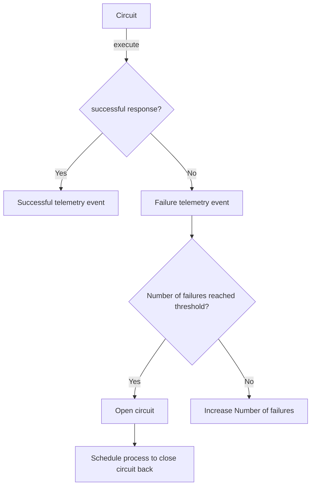

# Virgil

Virgil is an Elixir library designed to abstract and simplify the utilization of internal circuit breakers within applications. Its primary function is to act as a guardian, ensuring uninterrupted operation even in the face of recurrent errors.

## Installation

If [available in Hex](https://hex.pm/docs/publish), the package can be installed
by adding `virgil` to your list of dependencies in `mix.exs`:

```elixir
def deps do
  [
    {:virgil, "~> 1.0.1"}
  ]
end
```

Documentation can be generated with [ExDoc](https://github.com/elixir-lang/ex_doc)
and published on [HexDocs](https://hexdocs.pm). Once published, the docs can
be found at <https://hexdocs.pm/virgil>.

## Custom circuit example

### Defining circuit module

You can define a module that represents an application circuit following the example:

```exs
defmodule MyCustomCircuit do
  @moduledoc false

  # error_threshold: max number of tries until the circuit be openned
  # reset_timeout: timeout in seconds until the manager opens circuit back
  use Virgil.Circuit,
    error_threshold: 5,
    reset_timeout: 10

  def run(%{document_number: document}) do
    response = Tesla.get("https://my-bureau-api.com/", query: [document: document])

    case response.status do
      200 -> {:ok, response}
      401 -> {:error, :unauthorized}
      500 -> {:error, :api_error}
    end
  end
end
```

### Executing circuit

You can execute the circuit pipeline using the `MyCustomCircuit.execute/1` function.
This function receives one argument and pass it to the defined `MyCustomCircuit:run/1` function.

```exs
%{document_number: "11122233300", name: "John Doe"}
|> MyCustomCircuit.execute()
```

### Circuit Flow


